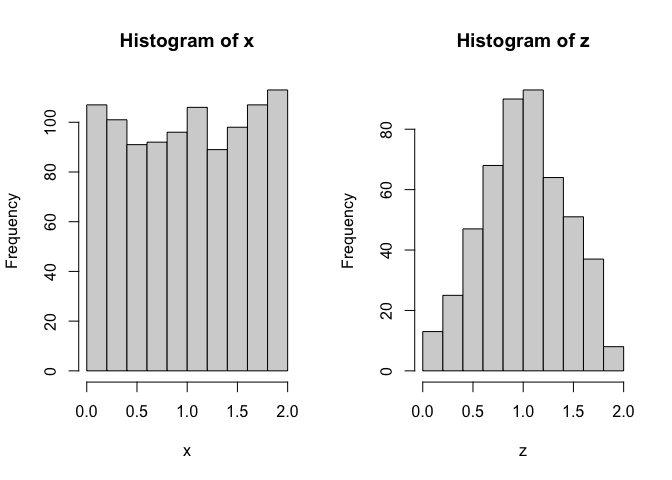

Num_gen
================
2025-02-01

``` r
a = 2
c = 5
m = 5
seed = 1

ans = rep(0, 10)
ans[1] = (a * seed + c) %% m
```

``` r
lcg = function(a, c, m, seed, nnum = 100) {
  ans = rep(0, nnum)
  ans[1] = (a * seed + c) %% m #the first number
  for (i in 2:nnum)
    ans[i] = (a * ans[i - 1] + c) %% m
  return(ans)
  
}

lcg(a = 10, c = 7, m = 1, seed = 4, nnum = 15)
```

    ##  [1] 0 0 0 0 0 0 0 0 0 0 0 0 0 0 0

The numbers Ui are supposed to follow a “discrete uniform” distribution
on the integers 0 to m − 1.

The period of a generator is the number of elements observed before the
sequence begins to repeat itself. The choice of a, c, m affects period
and autocorrelation.

For the mixed LCG, the period will be m(full) if all the following
conditions are satisfied: 1 a−1 is a multiple of q for every prime
factor q of m. 2 if m is a multiple of 4, then a−1 is also a multiple of
4. 3 c is relatively prime (no common prime factors) to m.

simplified conditions All these conditions for full period generator are
met if 1. m = 2k, for some integer k. 2. a = 4b + 1, for some integer b.
3. c is an odd integer.

``` r
randudat = lcg(a = 5, c = 7, m = 2^10, seed = 4, nnum = 500) / 2^10
par(mfrow = c(1,2))
plot(randudat)
hist(randudat)
```

<!-- -->

## generate a rv from an arbitrary density f

``` r
#Generate a vector of 10 exponential random numbers:
set.seed(2)
U = runif(10)
X = -log(1-U)

X
```

    ##  [1] 0.2044227 1.2119177 0.8517358 0.1839852 2.8795387 2.8730715 0.1382958
    ##  [8] 1.7924526 0.6311466 0.7984716

more examples

``` r
#Generate a vector of 10 random variables with specified density
# f(x) = 2/x^3 for x > 1
n = 10
U = runif(n)
X = (1 - U)^(-0.5)

X
```

    ##  [1] 1.495161 1.146246 2.043428 1.104868 1.296715 2.613082 6.509237 1.136529
    ##  [9] 1.342081 1.039739

Suppose we are given a more complicated cdf: 0, x \< 0, x / 8 , 0 ≤ x \<
2, x^2/16, 2 ≤ x \< 4, 1 , x ≥ 4.

``` r
n = 10
U = runif(n)
X = (U < 1/4) * 8 * U + (U >= 1/4) * 4 * sqrt(U)

X
```

    ##  [1] 3.254286 2.490139 3.659266 1.204012 2.357192 2.796493 1.193975 2.390189
    ##  [9] 3.924577 1.058976

### generate discrete rvs

``` r
# generate n bernoulli trials with probability p
easybinom = function(n, p) {
  out = sum(runif(n) < p)
  return(out)
}

easybinom(10, 0.7)
```

    ## [1] 7

``` r
#testing
runif(2*5)
```

    ##  [1] 0.9817279 0.2970107 0.1150841 0.1632009 0.9440418 0.7948638 0.9746879
    ##  [8] 0.3490884 0.5019699 0.8103973

``` r
mat = matrix(runif(2*5), nrow = 5) # need to generate all the numbers first, then arrange them in 5 rows...
res = mat < 0.5
res
```

    ##       [,1]  [,2]
    ## [1,]  TRUE FALSE
    ## [2,]  TRUE FALSE
    ## [3,] FALSE FALSE
    ## [4,] FALSE FALSE
    ## [5,]  TRUE FALSE

``` r
res %*% rep(1 , 2)
```

    ##      [,1]
    ## [1,]    1
    ## [2,]    1
    ## [3,]    0
    ## [4,]    0
    ## [5,]    1

``` r
as.vector(res %*% rep(1 , 2)) # the result is a 5x1 matrix, then convert to vector
```

    ## [1] 1 1 0 0 1

``` r
# function that returns the number of successes in several binomial trials
mybinom = function(num, n = 10, p = 0.5) {
  umat = matrix(runif(n * num), nrow = num) # each row contains n bernoulli trials
  res = umat < p
  return(as.vector(res %*% rep(1 , n)))
}
mybinom(num = 20)
```

    ##  [1] 5 4 3 4 7 1 5 7 7 8 5 7 6 4 4 6 6 8 8 6

## acceptance rejection method

use when can’t obtain a closed form inverse cdf

``` r
# fdens is a pre-defined target density function
# gdens is a pre-defined convenient density function
# M is the scaling factor
# x is the vector of random variables generated from gdens
accrej = function(fdens, gdens, M, x) {
  U = runif(length(x))
  selected = x[U <= (fdens(x) / (M * gdens(x)))]
  return(selected)
}
```

witch’s hat

``` r
unif02dens = function(y)
  return(1/2 * (y >= 0  & y <= 2))
witchshatdens = function(y)
  return((y >= 0 & y <= 1) * y + (y > 1 & y <= 2) * (2-y))
accrej = function(fdens, gdens, M, x) {
  U = runif(length(x))
  selected = x[U <= (fdens(x) / (M * gdens(x)))]
  return(selected)
}
x = runif(1000) * 2 #generating 1000 unif(0,2) rvs
z = accrej(fdens = witchshatdens, gdens = unif02dens, 2, x)
```

Histograms of candidate (left panel) and “accepted” (right panel)
pseudorandom variables

``` r
par(mfrow = c(1,2))
hist(x)
hist(z)
```

<!-- -->

``` r
ncandidates = 10
u = runif(ncandidates) #generate uniform random numbers from U(0,1)
x = tan(pi * (u - 0.5)) #generate candidate samp from a cauchy (gdens)

M = sqrt(2*pi/exp(1))
normaldens = dnorm(x)
cauchydens = dcauchy(x)

x[u <= normaldens/(M * cauchydens)]
```

    ## [1] -0.52248568 -0.05458963  0.04831466 -0.19175833 -0.33799748  0.90198480
